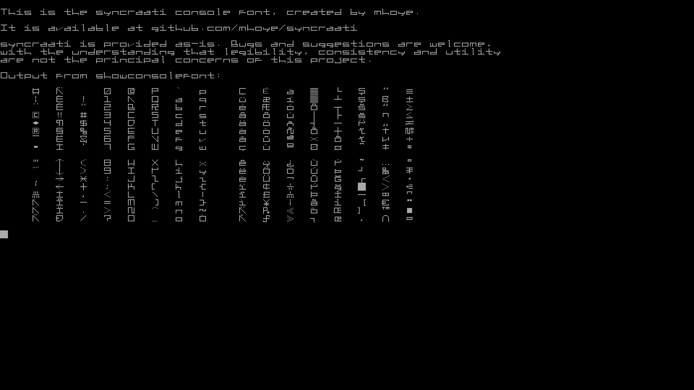

# Syncraati 

## A Linux console font by mhoye

[Syncraati](https://github.com/mhoye/syncraati) is a console 
font for Linux created as an homage to the angular, stylized text 
of now-ancient vector-graphics games and various sci-fi interfaces.

While incremental improvements are certainly welcome, the author is 
well aware of the uneven letter heights and other inconsistencies; before
filing a bug, please understand that legibility and usability are not
the principal concerns of this project.

## The How

The "psfc" and "psfd" from the psftools package make it very easy
to start modifying console fonts to your liking. If you're already 
working in a console regularly this (somewhat verbose, but shell history 
will save you) command makes it easy to modify fonts and see your progress: 

    psfc syncraati.txt syncraati.psfu && setfont syncraati.psfu && showconsolefont

Broken down, that command means "convert syncraati.txt to a console font, 
set my current console font to that font, and show me a table of all
of its glyphs."

To get this started, I used psfd to dump a text version of Uni2-Terminus22x11 and
used sed to double the width of the font by simply doubling every . and # character,
and then customizing them all.

You can you can see the output of showconsolefont in "syncraati.jpg", 
created with Gunnar Monell's very useful ['fbgrab'](https://github.com/GunnerMonell/fbgrab) utility.

On Debian, the default set of console fonts are in /usr/share/consolefonts/.
If you copy syncraati.psfu into that folder, you can set your console font
with 

    setfont syncraati

at any time. If you'd like syncraati to be the default for your user account
you can append "setfont syncraati" to your .bashrc file, or whatever 
configuration file works in your shell of choice. 

If you'd like to make a new console font the system default, then edit
 
    /etc/default/console-setup

by commenting out the FONTFACE and FONTSIZE statements, and adding 

    FONT=syncraati.psfu

... and either logging out and logging in again, or simply rebooting.

Note that this font and all the advice above has been tested on exactly
one, exceedingly idiosyncratic debian-based machine, by the person who
wanted his console to look this way.  

-mhoye
